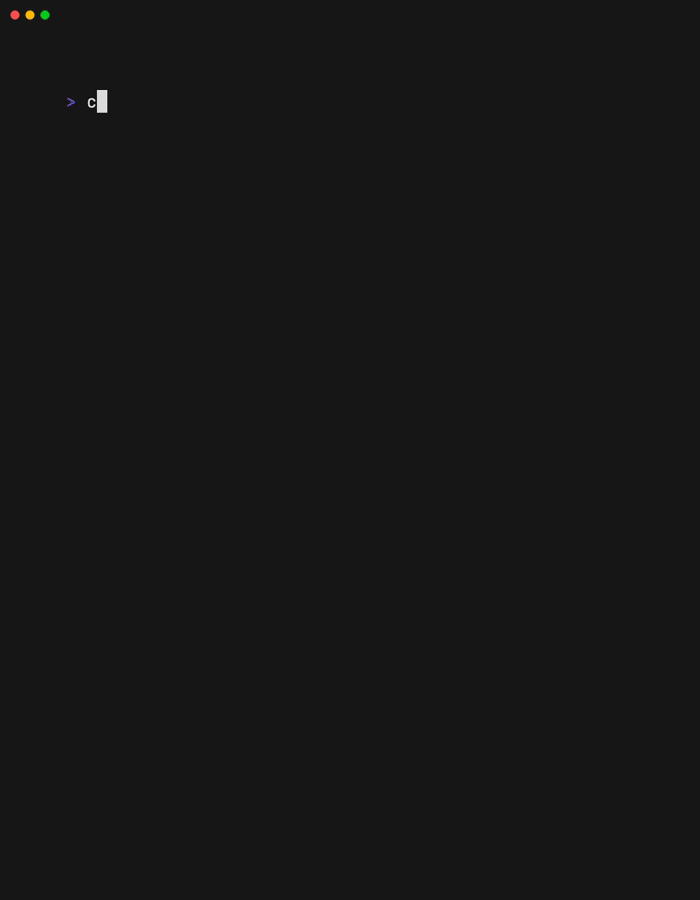

## cert-check

`cert-check` is a simple terminal UI tool to check domain's certificate expiry date.

  

## Features

- add multiple domains
- remember added domains
- filter domain list

## Installation

You can download the appropriate binary from the [release page](https://github.com/somnek/cert-check/releases).

#### Note:

If you're on macOS, you may need to run `xattr -c ./Cert\ Check\ Darwin.gz` to (to avoid "unknown developer" warning)

## Controls

| Shortcut | Action |
| -------- | ------ |
| `a`      | Add    |
| `x`      | Delete |
| `?`      | Help   |
| `q`      | Quit   |
| `/`      | Filter |
| `↓/j`    | Down   |
| `↑/k`    | Up     |
| `→/l`    | Next   |
| `←/h`    | Prev   |
